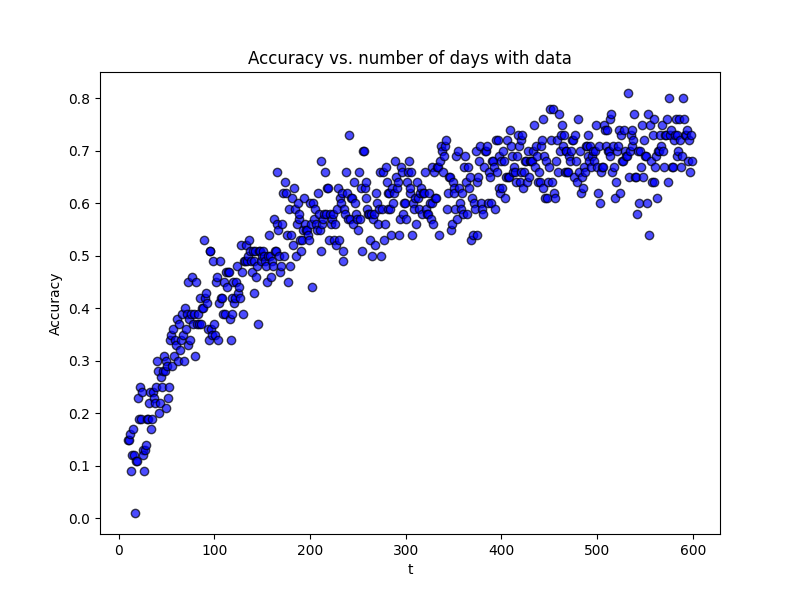
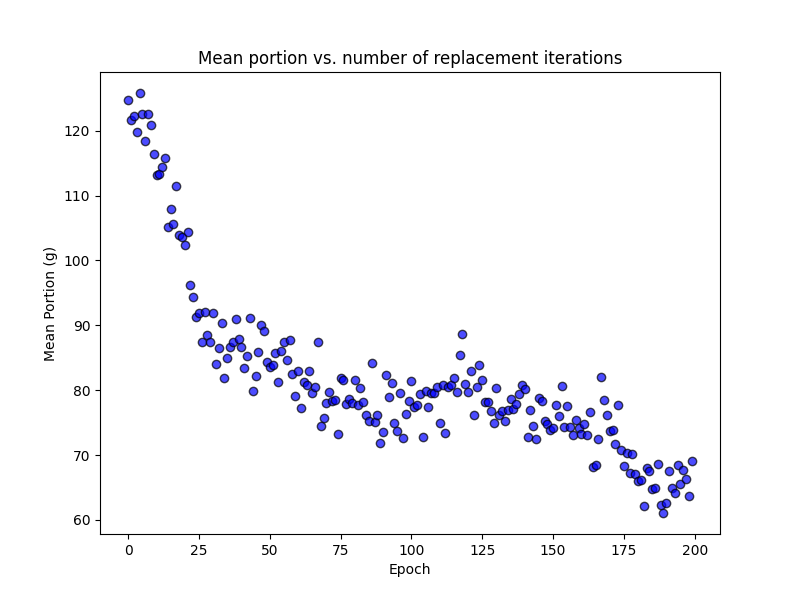

# Chipotle Portion Analysis

## Overview & Model Setup

This project investigates the potential capability of the fast-food chain Chipotle to control portion sizes at a certain location with only limited data. We assume that the data available to a Chipotle location is an employee schedule (i.e. a matrix of which employees have worked on which day) and an inventory (i.e. a vector of an ingredient's consumption on each day). For this project, we are interested in chicken consumption. Chipotle's website indicates that each chicken bowl should contain 113 grams of chicken. Suppose each of $n$ employees gives a portion $p_j \sim \mathcal{N}(113, 25)$, where $j = 1, 2, ..., n$. Every day $m \leq n$ employees are scheduled to work.

The schedule matrix $S$ is defined by:

$$
S_{ij} = \begin{cases}
    1, & \text{if employee } j \text{ works on day } i \\
    0, & \text{otherwise}
\end{cases}
$$

Then we can compute each day's expected portion size (consumption) $Y = \frac{1}{m}Sp$ where $p = (p_1, p_2, ..., p_n)$.

Finally, we want to fit the model:

$$
Y_i = \alpha + \beta_1 \cdot S_{i1} + \beta_2 \cdot S_{i2} + \dots + \beta_n \cdot S_{in}
$$

where each $\beta_j$ indicates employee $j$'s predicted portion size above the mean.

## Simulations

Chipotle may be interested in replacing the employee with the largest portion size in order to mitigate operating costs. The index of the true worst-performing employee is $\theta = \text{argmax } p$, and the index of the predicted worst-performing employee is $\hat{\theta} = \text{argmax } \beta$ where $\beta = (\beta_1, \beta_2, ..., \beta_n)$.

### Prediction Accuracy

First, we can look at the accuracy of $\hat{\theta} = \theta$ as the number of days of schedule and consumption data $t$ varies. This variable corresponds to the number of rows of both the schedule matrix and the consumption column vector. From some research on Chipotle's staffing practices, we will assume that $m = 3$ and $n = 20$. That is, there are 20 total employees at the certain Chipotle location, and a random choice of 3 employees work the food assembly line on any given day. For each $t$, we will run 100 simulations and report the accuracy of $\hat{\theta} = \theta$. Here are the results for $t \in {100, 101, ..., 600}:

Clearly, the accuracy of predicting the worst-performing employee increases as the number of days with data increases.

### Portion Reduction

Next, we can use these performance predictions to simulate a Chipotle location's staffing operation. The steps are as follows:
1. Generate an initial vector of 20 employees' portion sizes $p = (p_1, ... p_20)$ where $p_i \sim \mathcal{N}(113, 25)$.
2. Simulate 30 days of scheduling and chicken consumption, and predict the worst-performing employee $j = \text{argmax } \beta$.
3. Replace $p_j$ with a new portion from the distribution $\mathcal{N}(113, 25)$ (i.e. replace the worst-performing employee with a new employee).
4. Repeat steps 2-3 as many times as desired.

Below are the results for 200 replacement iterations every 30 days:

The plot of average portion sizes illustrates that Chipotle can drive down portion sizes (even far below the target portion size of 113 grams) by incorporating the model designed in this project as an employee performance review.

## Conclusion

Does Chipotle use a practice such as this model to mitigate portion sizes at their locations? I don't know--I haven't worked at a Chipotle. But, the purpose of this project was to explore if Chipotle *can* predict their highest-cost employee with nothing but schedule and inventory data. While I acknowledge that this model is an enormous oversimplification of a Chipotle's operations, it is very effective at keeping portion sizes down.